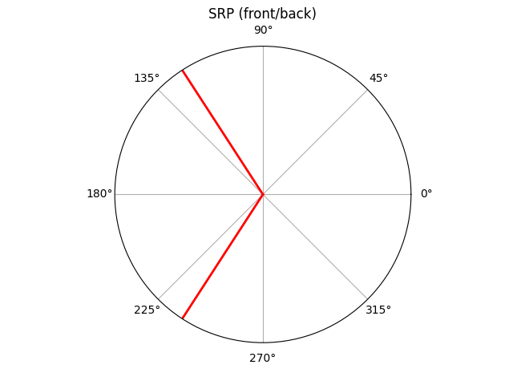

# Passive Sonar Sound Localization

This is a project I am doing in my free time at work to study how sonar and other sound localization technologies work. Currently, I can find out where a sound originates only by azimuth.

I am working on creating a microphone array to achieve better precision and a better estimate of the true location. I am experimenting with recordings from an in line 4 mic array to start with, but I have a total of 8 microphone that I can use so I will eventually create a proper 2 dimensional array to give an attitude direction and a distance estimate.

To achieve this, I am using beamforming algorithms, which works by shifting the microphone recordings by a certain delay until the sound power reaches its peak. This works because each microphone is spaced away from eachother by the same distance, so a sound will reach each microphone at different intervals. By looking at which microphone was delayed and by how much, we can then get an estimate of the location of the sound. 

I am making use of the Pyroomacoustics library in this project as it does a lot of heavy lifting with the complex algorithms used and its great simulation functionality. This being just a proof of concept/prototype, I am not worried about writing everything from scratch, but rather learning the audio concepts and how to apply them in code.

## How to run
To test it out yourself, you can start the  `live_array.py` file in your preferred IDE (I personally used PyCharm).

### Modifying to use your own microphone array
You can modify the `mic_spacing` and `num_mics` parameters at the top of the Python file. Use meters for spacing (eg: 0.2 for 20 cm spacing).

Your microphones need to be connected to a sound interface capable of using multiple microphones at the same time. Most commonly, you will find interfaces that can take only two microphones, which does not work with this program. Make sure to set your default input device as the interface.

### Noted Issues
I have had problems running this on Windows before. It has to do with the way Windows handles multiple channel inputs. On macOS, it is possible to create an aggregate device, but I have yet to find a reliable solution. 

## Development Checklist

- [X]  Find azimuth from stereo microphone recording using GCC PHAT
- [X]  Simulate a 4 microphone line array and compare which algorithm is best
- [X]  Find azimuth of a static sound from a real 4 microphone line array

- [X]  Modify the program to handle moving sounds
- [ ]  Build a 2 dimenional mic array 
- [ ]  Find azimuth and attitude of sound and diplay it nicely

